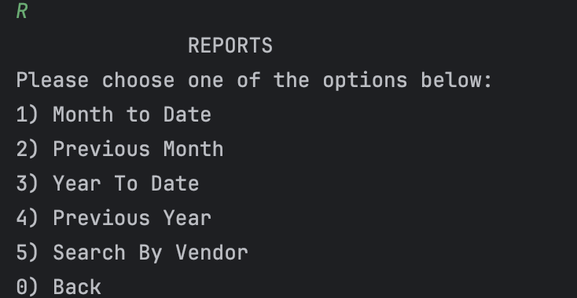
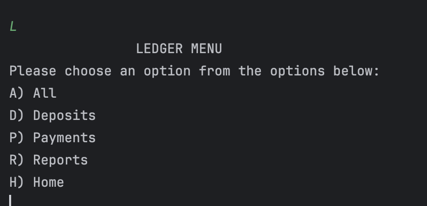
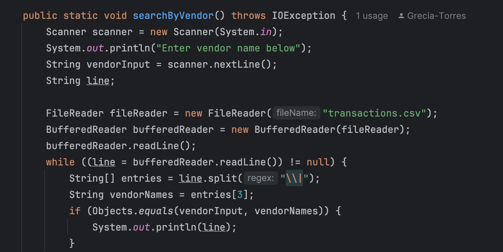

# Accounting Ledger Application
## Java CLI Application
This CLI application tracks all financial transactions for a business
or can also be used for personal use. All the transactions in this
application are read from and saved to a transaction file
named transactions.csv. The application has several screens such as a
Home Screen, Ledger Screen, and Reports Screen.
## Home Screen
This screen gives user the option to add a deposit, make a payment,
to display the ledger screen or to exit the application.

## Reports
This screen allows the user the option to run a custom search
on month to date entries, previous month entries, year to date entries,
previous year entries or to search by specific vendor.

## Ledger
This screen allows the user to display all the entries, deposit entries,
payment entries, report screen, or to go back to the home screen.

## Interesting Code
I thought this was an interesting piece of code because I realized
that I didn't need to add an array list and unnecessary code like I had been doing
for the ledger code.

